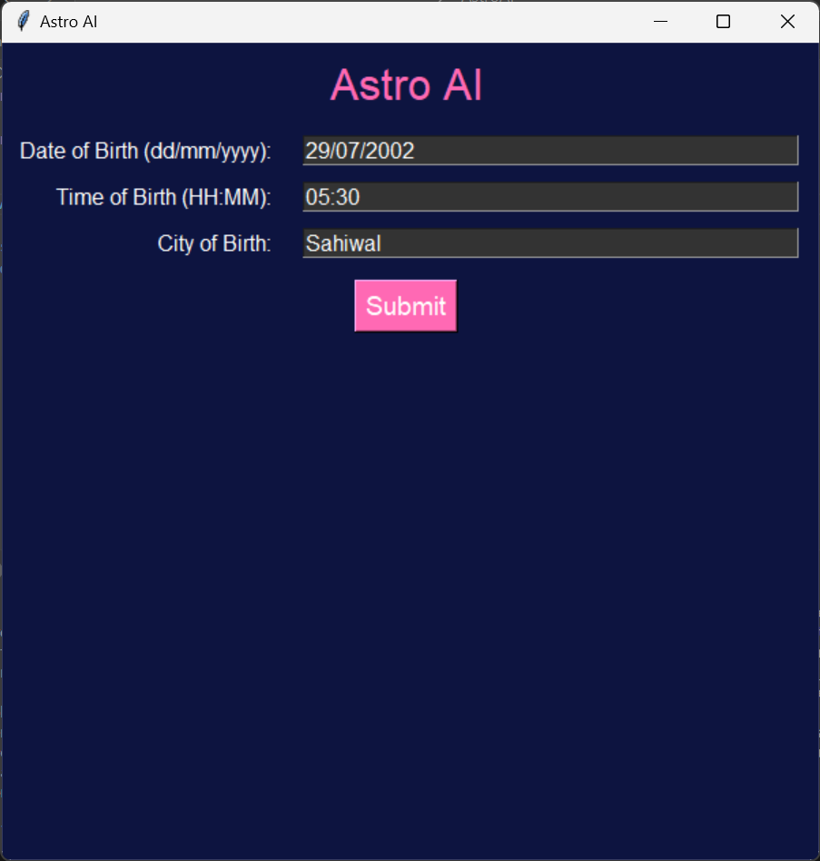
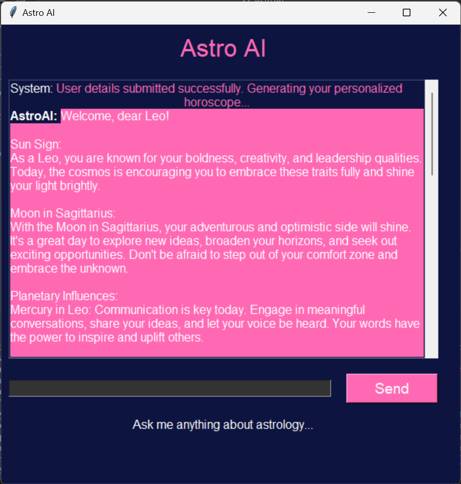

# AstroAI


AstroAI is an interactive desktop application designed to provide personalized horoscopes and astrological insights based on user-provided birth details. This application utilizes the Tkinter library for the graphical user interface and OpenAI's GPT-3.5-turbo model for generating astrological content.

## Features

- **Personalized Horoscope Generation:** Generates a detailed horoscope based on the user's birth details.
- **Astrological Insights:** Users can ask questions related to astrology and receive informative responses.
- **Engaging Chat Interface:** Provides a conversational interface for interacting with the user.

## Demo

Check out the demo video to see AstroAI in action: [AstroAI Demo](https://drive.google.com/file/d/15UODIiqQoYQmN5iTmTrwF1-dzwgU-zAg/view?usp=sharing)

## Requirements

- Python 3.x
- Tkinter library (usually included with Python)
- Requests library
- OpenAI API Key

## Installation

1. **Clone the Repository:**
   ```bash
   git clone https://github.com/fatimaazfar/Astrology-Chatbot.git
   cd astroai
   ```

2. **Install Dependencies:**
   ```bash
   pip install requests
   ```

3. **Set Up OpenAI API Key:**
   Open the `astroai.py` file and replace `'your-openai_API-key'` with your actual OpenAI API key:
   ```python
   OPENAI_API_KEY = 'your-openai_API-key'
   ```

## Usage

1. **Run the Application:**
   ```bash
   python astroai.py
   ```

2. **Enter Your Birth Details:**
   - **Date of Birth:** Enter your date of birth in the format `dd/mm/yyyy`.
   - **Time of Birth:** Enter your time of birth in the format `HH:MM`.
   - **City of Birth:** Enter the city where you were born.

3. **Submit Your Details:**
   Click the "Submit" button to submit your birth details. The application will then generate a personalized horoscope for you.

4. **Interact with the Chatbot:**
   After submitting your details, the chat interface will become active. You can ask questions related to astrology, and the chatbot will provide relevant insights and answers.

## Code Structure

### Initialization

The `GPTChatbotApp` class initializes the main window and sets up the user interface components.

### Input Fields

Helper function `create_input_field` is used to create labels and entry fields for user inputs.

### Submitting User Details

The `submit_details` method collects user inputs and constructs a custom prompt for generating personalized horoscopes.

### Displaying Messages

Messages are displayed in the chat interface using the `display_message` method.

### Fetching Responses

The `get_welcome_message` method sends a request to OpenAI to generate a welcome message and horoscope based on user details. The `send_message` method handles user input, and `get_response_from_gpt3` fetches responses from OpenAI based on the conversation history.

## Example

Here is a brief example to illustrate the usage of AstroAI:

1. **Running the Application:**
   ```bash
   python astroai.py
   ```

2. **Entering Birth Details:**
   

3. **Interacting with the Chatbot:**
   

By following these steps, you can get started with AstroAI and explore the personalized astrological insights it provides.

## Support

If you encounter any issues or have questions about AstroAI, please contact fatimaazfar381@gmail.com for assistance.
